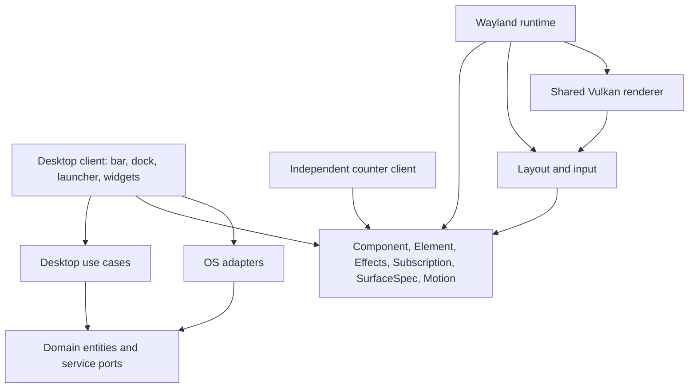

# Framework concepts and client boundaries

The framework is a small, implemented vertical stack. The two clients are
`lucent-desktop` and the independent `hello-layer` counter. There are no empty
crates standing in for future subsystems.



| Crate | Responsibility |
| --- | --- |
| `lucent-domain` | Application IDs/commands, windows/workspaces, desktop settings, clock/date, media/system/weather snapshots, timer state; application/compositor/settings ports |
| `lucent-usecases` | Ranked app search, launch-versus-focus policy, validated widget movement, visibility, settings validation |
| `lucent-api` | Declarative elements, typed component messages, async effects, subscriptions, surface intent, animations, widget registration |
| `lucent-ui` | Layout constraints, clipping, hit testing, drag threshold, text input, retained hover/focus state |
| `lucent-render` | One wgpu Vulkan device, rounded primitives, shadows, cached text/images, clipping and alpha composition |
| `lucent-wayland` | SCTK layer surfaces, seats/keyboard/pointer, callback scheduling, subscription lifetime, effect worker, bounded local IPC |
| `lucent-services` | XDG desktop entries/icons, Hyprland Lua IPC/events, atomic settings, bounded CLI adapters for system/media/weather/wallpaper |

The API and pure domain intentionally do not depend on each other: another shell
can use the UI framework with different domain concepts. Framework code does not
know about Lucid's colors, panels, calendar or launcher. All those decisions live
in the desktop application. OS commands run on worker threads, never inside a
component's `view` or the Vulkan draw loop.

## Components and message composition

```rust
use lucent_api::*;

#[derive(Clone)]
enum Message { Increment }
struct Counter(u32);
impl Component for Counter {
    type Message = Message;
    fn view(&self, _: &ViewContext) -> Element<Message> {
        Element::row(vec![
            Element::text(format!("Count: {}", self.0)),
            Element::button("Add", Message::Increment).id("increment"),
        ]).gap(12.).padding(16.)
    }
    fn update(&mut self, _: Message, effects: &mut Effects<Message>) {
        self.0 += 1;
        effects.redraw("example");
    }
}
```

A parent can render `child.view(cx).map(ParentMessage::Child)` and delegate updates
to the child using `effects.delegate(|child_fx| child.update(message, child_fx), ParentMessage::Child)`. Delegation preserves time, redraw requests and typed async results. Mapping also lifts input and drag callbacks. Stable element IDs
preserve hover and keyboard focus between views. The client owns state; the
runtime delivers messages on one UI thread. It never mutates a view tree in place.

Supported primitives: text, image, button, single-line input, row, column, stack,
grid and empty shape. `Length::{Fixed, Fill, Shrink}`, padding, gaps, alignment,
absolute positioning within a stack, clipping, opacity, rounded corners and
shadows cover the implemented clients. Rich text, selection/caret editing and
IME protocols are not yet implemented. Registered font faces are chosen by index;
layout and rendering use the same font metrics.

## Effects, subscriptions and services

`Effects::task` runs a blocking operation on an ordered worker and returns a typed
message. Ordering keeps config writes from overtaking each other. Long-lived
service streams use `Subscription::stream(id, |emitter, cancellation| ...)`.
The runtime starts each stable ID once and cancels it when it disappears or the
application exits. `Subscription::every` is a convenience for bounded periodic
sources. A subscription whose parameters change must use a new ID or explicitly
react to its own configuration; a stable ID is not automatically restarted.

The compositor adapter subscribes to Hyprland's event socket and queries fresh
snapshots on relevant events, reconnecting after disconnection. Clock, system,
media and weather adapters currently poll at 1 second, 5 seconds, 2 seconds and
15 minutes respectively. Components invalidate only surfaces whose visible data
changed. These CLI adapters are intentionally an initial implementation; native
D-Bus service subscriptions and device-control ports can replace them without
moving OS work into views.

XDG `Exec` is parsed into an executable and argument array, including supported
field codes. It is never evaluated by a shell. Application launching and dock
focus policy are tested using mock application/compositor ports. Invalid desktop
entries, unsupported field codes and unsupported settings versions fail explicitly.

## Surfaces and input

`Application::surfaces()` declares each surface's stable ID, layer, anchor, size,
exclusive zone, keyboard interactivity, visibility and full-input-capture intent.
The runtime reconciles these declarations and keeps native handles private.

Lucent uses three native surfaces:

- A top bar reserving 56 logical pixels.
- A bottom-layer widget host with input regions matching interactive widgets.
- A dock host switching from the top layer to an exclusive-keyboard overlay while
  the launcher is open. Clicking outside closes it; otherwise transparent areas
  pass through to applications.

Dragging reports displacement from the original press in the stationary surface's
coordinates. The use case clamps placement and saves only on release. A five-pixel
threshold prevents a drag from launching an app or activating a button.

The current backend targets one compositor-selected output and supports integer
buffer scaling. Output selection, fractional scaling, touch and xdg-shell windows
are not implemented. A compositor-closed layer currently ends the client.

## Animation and rendering

`Motion` is an interruptible cubic Bézier timeline. Retargeting starts from the
current interpolated value. The desktop's spatial curve is `[0.38, 1.21, 0.22, 1]`:
500 ms for dock/panel geometry and wallpaper selection, 350 ms for app selection.
Content enters over 320 ms and leaves over 190 ms using `[0.05, 0.7, 0.1, 1]`.
These values were inspected in the pinned Lucid reference.

A client reports active motion through `Application::animating(surface, now)`.
The framework merges invalidations while a compositor frame callback is pending,
then renders only when needed. Hover animations use the same scheduler. No
permanent animation timer repaints the screen. Multiple surfaces share one Vulkan
device, pipeline and bounded resource cache. Text is rasterized when content,
font face, size or scale changes, then positioned with GPU geometry during motion.
This uses cached glyph rasterization, not a full complex-script shaping engine.

## Widget registration

`WidgetRegistry<Client, Message>` maps stable widget IDs and descriptors to view
functions. Duplicate IDs are rejected. The desktop registers seven widgets and
persists positions/visibility by ID. The framework contains no built-in widget
list. Registry views are stateless; a client stores their state or composes child
`Component`s when local state is useful. Dynamic plugin loading is deferred.

## Extension boundaries

A new desktop design can reuse `lucent-api`, `lucent-ui`, `lucent-render` and
`lucent-wayland` without importing the desktop client. A new compositor adapter
implements the domain port and event stream. New OS services should expose typed
results and subscription messages; add a port when a use case needs one, rather
than creating interfaces without an implemented consumer.

The renderer and runtime remain replaceable implementations, not public raw-handle
APIs. Authentication stays with Omarchy's proven lock implementation. An ordinary
layer surface is never treated as a secure lock screen.
