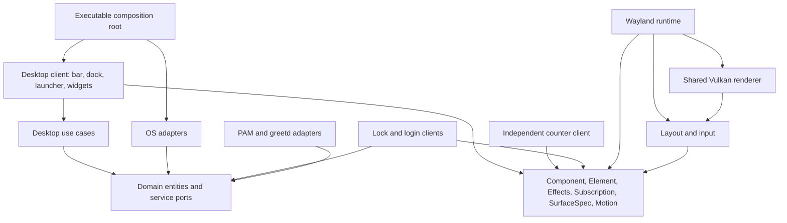

# Framework concepts and client boundaries

The framework is a small, implemented vertical stack. Clients include `lucent-desktop`, the shared `SessionScreen` used by
`lucent-lock` and `lucent-greeter`, the native `lucent-menu` picker, and the independent `hello-layer` counter. There are no empty
crates standing in for future subsystems.



| Crate | Responsibility |
| --- | --- |
| `lucent-domain` | Application IDs/commands, windows/workspaces, desktop settings, clock/date, media/system/weather snapshots, timer state; application/compositor/settings ports |
| `lucent-usecases` | Ranked app search, launch-versus-focus policy, validated widget movement, visibility, settings validation |
| `lucent-api` | Declarative elements, typed component messages, async effects, subscriptions, surface intent, animations, widget registration |
| `lucent-design` | Optional Lucent visual language: generated primitive/semantic/component tokens, light/dark theme and recipes |
| `lucent-ui` | Layout constraints, clipping, hit testing, drag threshold, text input, retained hover/focus state |
| `lucent-render` | One wgpu Vulkan device, rounded primitives, shadows, cached text/images, clipping and alpha composition |
| `lucent-wayland` | SCTK layer surfaces, seats/keyboard/pointer, callback scheduling, subscription lifetime, effect worker, bounded local IPC |
| `lucent-auth` | PAM conversations for the current account; greetd authentication and session startup |
| `lucent-services` | XDG desktop entries/icons, Hyprland Lua IPC/events, atomic settings, bounded CLI adapters for system/media/weather/wallpaper |

The API and pure domain intentionally do not depend on each other: another shell
can use the UI framework with different domain concepts. Framework code does not
know about Lucid's colors, panels, calendar or launcher. All those decisions live
in the desktop application and its optional `lucent-design` dependency. OS commands run on worker threads, never inside a
component's `view` or the Vulkan draw loop.

## Programming model and design system

Rust structs own state; traits define contracts; functions compose views and use
cases. There is no class inheritance. `view(&self, cx)` reads state and describes
an element tree; `update(&mut self, message, effects)` changes state. OS work stays
behind effects and service ports. This is a declarative view with explicit mutable
state, rather than a purely functional application.

`design/tokens.json` is the shared source for primitive palette/spacing/type,
semantic light/dark roles, component geometry and motion. Run
`python3 scripts/generate-design-tokens.py` after editing it. Generated Rust
constants live in `lucent-design`; CSS variables feed the Astro site. CI checks
references, types, cycles and generated drift. Native views use token references,
including structural dimensions such as `component::launcher::ROW_HEIGHT`.


The launcher, dock and bar share a spacing contract:

| Token | Logical pixels | Purpose |
| --- | --- | --- |
| `layout.unit` | 4 | Compact insets and structural token validation |
| `layout.control_step` | 8 | Tab slots and control spacing |
| `layout.shell_step` | 16 | Settled shell bounds, launcher rows, panel insets and widget anchors |
| `layout.section_gap` | 16 | Header/body/footer separation and minimum bar-group gaps |

`apps/lucent-desktop/src/shell_layout.rs` owns pure client geometry. Views and
animation targets use the same calculations. Launcher rows and input are 48
pixels high; header slots have fixed widths, and the theme cards derive their
equal widths from the actual gap. Panel height follows content, rather than an
independent handwritten total. Small viewports show fewer complete rows and
keep the selected row reachable. Dock slots have equal outer padding.

Settled panels use widths in pairs of shell cells and share a fixed grid-aligned
center. Their bottom edge uses the last grid line before the screen inset. At
resolutions that are not multiples of 16, the leftover pixels stay outside the
shell. Glyph metrics, aspect-fitted artwork, strokes and animation samples retain
their own precision; the renderer never rounds animated geometry to the grid.

Bar capsule widths derive from fixed control slots and gaps. They share the same
top and height. Optional media and clock capsules are omitted when they cannot
fit without overlap. At narrow widths, the workspace strip retains the active
workspace and shows as many neighbors as fit. Omarchy's workspace bindings remain
available for the rest.

Tests check actual painted capsules and search-field bounds, row containment,
equal gutters, grid alignment, selected-row visibility, and non-overlapping bar
and wallpaper controls. Merely using a named token is not sufficient.

`Theme::new(light)` provides `primary`, `on_primary`, `surface`,
`surface_container`, `on_surface`, `error`, `success`, `warning`, `info` and `focus`.
`Theme::button` composes a basic recipe, and `Theme::apply` supplies shared hover
color/timing, focus outlines and shadow recipes throughout a tree. Monochrome images use
`Element::tint` and `Element::contain`. Lucent's app artwork follows the same
semantic foreground; externally supplied XDG icons retain their original colors.
Contrast tests cover normal text, primary-action and error pairs in both themes.

The generic framework supplies neutral style defaults and unstyled buttons.
Clients may use a different design system without importing `lucent-design`.
The local site keeps its landing page at `/`, with `/docs/` for the engine model
and `/design-system/` for live specimens and the searchable source token catalog.

## Components and message composition

```rust
use lucent_api::*;

#[derive(Clone)]
enum Message { Increment }
struct Counter(u32);
impl Component for Counter {
    type Message = Message;
    fn view(&self, _: &ViewContext) -> Element<Message> {
        Element::row(vec![
            Element::text(format!("Count: {}", self.0)),
            Element::button("Add", Message::Increment).id("increment"),
        ]).gap(12.).padding(16.)
    }
    fn update(&mut self, _: Message, effects: &mut Effects<Message>) {
        self.0 += 1;
        effects.redraw("example");
    }
}
```

A parent can render `child.view(cx).map(ParentMessage::Child)` and delegate updates
to the child using `effects.delegate(|child_fx| child.update(message, child_fx), ParentMessage::Child)`. Delegation preserves time, redraw requests and typed async results. Mapping also lifts input and drag callbacks. Stable element IDs
preserve hover and keyboard focus between views. The client owns state; the
runtime delivers messages on one UI thread. It never mutates a view tree in place.

Supported primitives: text, image, button, single-line input, row, column, stack,
grid and empty shape. `Length::{Fixed, Fill, Shrink}`, padding, gaps, alignment,
absolute positioning within a stack, clipping, opacity, rounded corners and
shadows cover the implemented clients. Rich text, selection/caret editing and
IME protocols are not yet implemented. Registered font faces are chosen by index;
layout and rendering use the same font metrics.

## Effects, subscriptions and services

`Effects::task` runs a blocking operation on an ordered worker and returns a typed
message. Ordering keeps config writes from overtaking each other. Long-lived
service streams use `Subscription::stream(id, |emitter, cancellation| ...)`.
The runtime starts each stable ID once and cancels it when it disappears or the
application exits. `Subscription::every` is a convenience for bounded periodic
sources. A subscription whose parameters change must use a new ID or explicitly
react to its own configuration; a stable ID is not automatically restarted.

The compositor adapter subscribes to Hyprland's event socket and queries fresh
snapshots on relevant events, reconnecting after disconnection. Clock, system,
media and weather adapters currently poll at 1 second, 5 seconds, 2 seconds and
15 minutes respectively. Components invalidate only surfaces whose visible data
changed. These CLI adapters are intentionally an initial implementation; native
D-Bus service subscriptions and device-control ports can replace them without
moving OS work into views.

XDG `Exec` is parsed into an executable and argument array, including supported
field codes. It is never evaluated by a shell. Application launching and dock
focus policy are tested using mock application/compositor ports. Invalid desktop
entries, unsupported field codes and unsupported settings versions fail explicitly.

## Surfaces and input

`Application::surfaces()` declares each surface's stable ID, layer, anchor, size,
exclusive zone, keyboard interactivity, visibility and full-input-capture intent.
The runtime reconciles these declarations and keeps native handles private.

The desktop uses three persistent native surfaces and an on-demand notification surface:

- A top bar reserving 56 logical pixels.
- A bottom-layer widget host with input regions matching interactive widgets.
- A dock host switching from the top layer to an exclusive-keyboard overlay while
  the launcher is open. Clicking outside closes it; otherwise transparent areas
  pass through to applications.

Notification toasts/history use an overlay with bounded cards and action hit regions. The secure locker uses a different Wayland role: one `ext-session-lock` surface per output, including hotplugged displays.

Dragging reports displacement from the original press in the stationary surface's
coordinates. The use case clamps placement and saves only on release. A five-pixel
threshold prevents a drag from launching an app or activating a button.

The current backend targets one compositor-selected output and supports integer
buffer scaling. Output selection, fractional scaling, touch and xdg-shell windows
are not implemented. A compositor-closed layer currently ends the client.

## Animation and rendering

`Motion` is an interruptible cubic Bézier timeline. Retargeting starts from the
current interpolated value. The desktop's spatial curve is `[0.38, 1.21, 0.22, 1]`:
500 ms for dock/panel geometry and wallpaper selection. App selection is immediate.
Content enters over 320 ms and leaves over 190 ms using `[0.05, 0.7, 0.1, 1]`.
These values were inspected in the pinned Lucid reference.

A client reports active motion through `Application::animating(surface, now)`.
The framework merges invalidations while a compositor frame callback is pending,
then renders only when needed. Hover animations use the same scheduler. No
permanent animation timer repaints the screen. Multiple surfaces share one Vulkan
device, pipeline and bounded resource cache. Text is rasterized when content,
font face, size or scale changes, then positioned with GPU geometry during motion.
Shared kerning-aware logical advances keep layout, caret placement and text
rasterization consistent. Glyph coverage is sampled at twice the physical output
density and area-resolved once, then cached at output resolution. Text origins
snap to physical pixels; shapes continue moving at subpixel coordinates. The full
framebuffer is not supersampled. Complex-script shaping and IME remain open.

Source icons prefer SVG or high-resolution theme assets (128 px app icons,
256 px line symbols). Wallpaper previews use up to 1024 px per edge and Lanczos
resampling of premultiplied pixels; small originals are not enlarged. GPU image
textures include mip levels with trilinear sampling. Transparent edges stay
premultiplied throughout filtering and blending. These are quality/resource
budgets, separate from logical design dimensions. Source assets are prepared for
the current components at up to 2× density, not arbitrary unlimited zoom.

The cache evicts unused resources above 1024 entries or approximately 64 MiB of
texture payload. In-flight resources remain alive, and decoded source images,
framebuffers and driver allocations are separate from this cache budget.

## Widget registration

`WidgetRegistry<Client, Message>` maps stable widget IDs and descriptors to view
functions. Duplicate IDs are rejected. The desktop registers seven widgets and
persists positions/visibility by ID. The framework contains no built-in widget
list. Registry views are stateless; a client stores their state or composes child
`Component`s when local state is useful. Dynamic plugin loading is deferred.

## Extension boundaries

A new desktop design can reuse `lucent-api`, `lucent-ui`, `lucent-render` and
`lucent-wayland` without importing the desktop client. A new compositor adapter
implements the domain port and event stream. New OS services should expose typed
results and subscription messages; add a port when a use case needs one, rather
than creating interfaces without an implemented consumer.

The renderer and runtime remain replaceable implementations, not public raw-handle
APIs. The session client renders our lock and login UI through the same framework.
The secure lock runtime uses `ext-session-lock-v1`; PAM verifies the session
account, and greetd owns login authentication and session creation. An ordinary
layer surface is never treated as a secure lock screen.

## Keyboard state and visual regression checks

Framework interaction distinguishes pointer hover, keyboard focus and controlled
selection. Buttons support Tab / Shift+Tab traversal and Enter / Space activation.
`Element::selected(bool)` renders a persistent selected outline; `focus_within()`
lets a composite input field draw the focus outline around all its contents.
`tab_stop(false)` lets composite clients own keyboard navigation. `Theme::apply`
provides semantic focus color, outline width and caret width. Text, placeholder
and caret share the renderer's line metrics. A long input scrolls to keep its
end caret visible. General caret movement and IME are still future work.

The launcher owns Tab / Shift+Tab to cycle Apps → Commands → Wallpapers → Themes
→ Widgets. Arrows change selection, Enter activates it, Escape closes. This is
independent from pointer hover. Its app-list height is derived from visible rows,
header, search field and spacing, so seven rows fit after scrolling. Widget
switches use `Theme::switch_indicator`, drawn from tokens without font glyphs.

Shell icons use pinned Material Symbols Rounded SVGs (Apache-2.0), with sources,
license and checksums under `lucent-services/assets/material`. The notification
bell is an original MIT-licensed Lucent drawing in the same directory. The native icon
box preserves aspect ratio; 256 px sources and mip filtering support 1× and 2×.

`visual_tests.rs` exercises the actual client through the same `Layout`, `Paint`
and Vulkan `Canvas` used by Wayland presentation. `Gpu::headless` removes the
compositor requirement, not the renderer. Fixed application data, bundled fonts,
viewport and animation times make the fixtures repeatable. Sixty PNG baselines
cover dark/light, 1×/2×, all five sections, a narrow launcher, scrolling, empty
results, long input, an opening frame, notifications/history and lock/login UI. Geometry and keyboard tests separately
assert behavior so accepting an image cannot hide a clipped row.

```sh
# Host with a Vulkan driver (Mesa lavapipe recommended)
cargo test --manifest-path lucent/Cargo.toml -p lucent-desktop visual_regressions -- --ignored
# Or use the prepared VM's software Vulkan driver; no desktop changes
python3 vm/test-visual.py
# Real keyboard events in the unlocked VM
python3 vm/test-launcher.py
```

CI installs Mesa Vulkan, selects lavapipe and runs the snapshots explicitly.
Normal workspace tests skip that one GPU test. Differences above 8/255 in any
channel count as changed; more than 0.1% changed pixels overall or 1% in any
64×64 tile fails the case, so a missing small icon cannot hide in the background. Missing
images or dimensions also fail. Actual and difference images plus an HTML report
are written to `reports/local/visual-tests/` and uploaded as a CI artifact.
The threshold allows small driver rasterization differences; it is not a claim
that all renderers are pixel-identical.

For intentional design changes, run `python3 vm/test-visual.py --update` (or set
`LUCENT_UPDATE_GOLDENS=1` for the native cargo command), inspect every changed
baseline and the geometry tests, then commit the PNGs. Never update baselines just
to silence a failure. The design-system website shows representative native
captures, while its interactive browser examples remain illustrations.

## Rounded spacing, app icons and spatial alignment

`Padding { horizontal, vertical }` keeps content insets independent per axis.
`padding(v)` remains shorthand for equal insets; `padding_xy(x, y)` supports
capsules with generous ends and compact height. Measurement, placement and fill
constraints share those insets. The outer background and hit rectangle do not
shrink. The Lucent recipes use 20×8 for text buttons, 16×8 for launcher rows and
search, and 12×4 for bar capsules. Command icons and text use `Align::Center`.

`design/app-icons.json` owns 58 original MIT-licensed pictograms and exact desktop
ID aliases. `scripts/generate-app-icons.py` combines their vector artwork with
`app_icon.*` geometry tokens, emitting SVGs and a typed `AppIcon` catalog in
`lucent-design`. White alpha artwork receives the semantic foreground tint at
paint time on a transparent background, so theme changes require no rasterization.
Desktop effects rasterize the selected asset once; launcher and dock views
reference the same cached image by app ID. Unknown IDs use XDG icons,
then the generic Lucent glyph. Display names and arbitrary substring matching do
not select icons. Shell controls still use the separately licensed Material set.

Widget drag messages retain continuous coordinates until release. The release
use case snaps to `component.widget_layout.grid_step`, an alias of `space.lg`
(16 logical pixels), then clamps to the usable output. Saved and default anchors
use the grid; existing saved placements are retained until moved. Widgets keep
their own dimensions and do not avoid overlaps automatically. While a drag is
active, the desktop composes decorative grid lines behind the widgets using the
existing Element API. The spacing and line appearance use shared tokens. Lines
have no input handlers, so they never capture pointer events; there is no grid
special case in the renderer, layout engine or Wayland runtime.

`component.window.radius` references `radius.panel` (20 logical pixels). The token
generator also writes `configs/lucent/window-rules.lua`. Activation places that
compositor decoration default in a backed-up, managed block in user
`looknfeel.lua`; rollback removes only the block. Hyprland owns ordinary
application corners, including Chrome and terminals; no per-app class list is
needed. Re-run the token
generator and activation after changing this token. No packaged Omarchy file is
modified; fullscreen/no-gap compositor policies may still override decorations.


## Dependency injection and protocol boundaries

`Desktop::new(DesktopPorts)` receives trait objects for applications, compositor,
settings, clock, system sampling, audio, media, weather, wallpapers, session locking,
notifications and presentation assets. `platform.rs` is the composition root that
chooses concrete adapters. `desktop.rs`, `views.rs`, `widgets.rs` and the notification
component contain no platform commands or concrete service selection. Test adapters
can exercise the same component updates without inspecting or modifying the host.

The compositor port's subscription uses a domain callback and `StopSignal`, with no
framework `Message`, `Emitter` or cancellation type crossing into the adapter.
Presentation assets are deliberately a client-level port because pixel data is not
a pure desktop-domain concept. Framework crates do not depend on the domain,
Lucent's visual theme, service adapters or authentication adapters.

This is a practical ports-and-adapters structure, not a claim of a finished framework.
The launcher still shares `Desktop` state; audio/media use CLI adapters and polling;
layout has no general scroll container or complex-script shaping. OS operations
stay behind ports, while pure search, launch/focus, positioning and notification
expiry policy live in `lucent-usecases`. Architecture dependency checks enforce
these boundaries in CI.

## Notifications and secure session UI

`NotificationInbox` owns replacement IDs, timeout policy, bounded active/history
storage and DND. `FreedesktopNotifications` implements the standard D-Bus methods
and action/close signals. `Center` is a framework component composed into `Desktop`
with `Element::map` and `Effects::delegate`; it renders Vulkan cards, history pages,
DND, dismissal and application actions. History is in memory. Markup, image hints,
inline replies, sound and Omarchy-specific executable hints are not advertised.
Applications using standard action signals work without shell evaluation.

Quickshell retains its notification server for the process lifetime. Activation
records the original plugin state, disables only `omarchy.notifications`, uses
Omarchy's guarded shell restart while unlocked, and checks Lucent's bus ownership
before hiding the stock bar. Stop/failure restores the plugin and bar state. The
stock lock/polkit/idle services stay installed.

`SessionScreen` is a separate framework client with an injected
`AuthenticationPort`. `PamLocker` authenticates the current UID through the installed
`omarchy-lock-password` PAM policy and performs account checks. `Greetd` relays the
full visible/secret/information/error conversation to greetd and asks it to launch
`start-hyprland` only after success. Authentication and session management are
provided by PAM/greetd; Lucent supplies the presentation.

`run_locked` uses SCTK's secure session-lock protocol, covers every output and waits
for the compositor's acknowledgement before any authenticated unlock. An ordinary
exit or renderer failure never sends unlock. There is no lock/greeter command or
inspect socket. Owned authentication response buffers are scrubbed; only masked bullets enter the scene
and texture cache. The renderer remains the shared Lucent/wgpu Vulkan renderer.

Launcher selection is intentionally immediate: one selected row owns both fill
and outline. Dock/panel geometry retains its timed motion. Selection no longer
uses a separate 350 ms moving background.

Lock integration adds two commands in `~/.local/lib/lucent/bin`, referenced by
managed user Hyprland/PATH blocks. They route ordinary idle and pre-sleep requests
to the native service while Lucent is active, with compositor-lock acknowledgement
and a bounded deadline. Original `/usr/bin/omarchy-system-*lock` commands remain
the fallback; no packaged file or PAM policy is changed. Rollback removes the
managed startup, shortcut and PATH blocks.


Session wallpaper is a presentation dependency: `SessionAssets` returns decoded
pixels, and the executable selects the file adapter. `SessionScreen` requests it
through an effect after startup, then draws an `Element::image(...).cover()` behind
the authentication card. `ImageFit::{Fill, Contain, Cover}` belongs to the framework;
cover preserves aspect ratio and clips a centered image to its layout box. An
opaque base remains even when decoding fails. A user path unit synchronizes the
login copy, so the greeter never needs access to the desktop account's home.
