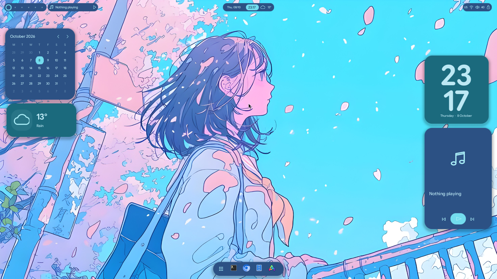
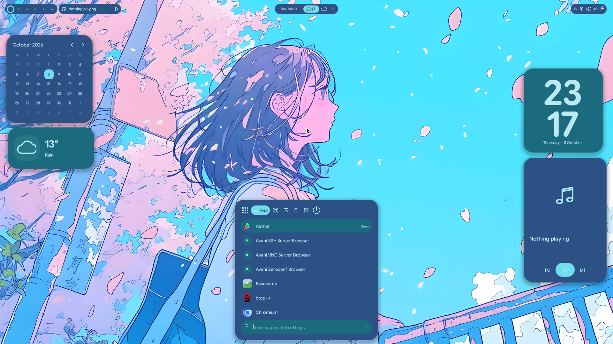
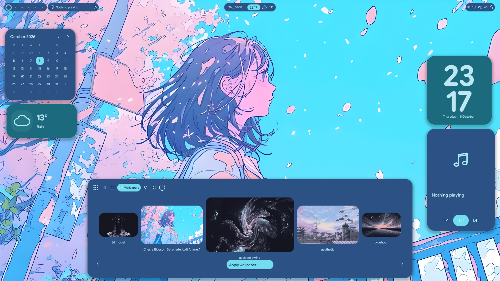

# Lucent framework and desktop validation

The sections below record successive builds; their counts and measurements are
historical. See the final section for the current native notification/session work.

The initial build was validated on the existing isolated Omarchy 4.0.4 / Hyprland 0.56.2 VM, with
1920×1080 output at scale 1, two virtual CPUs and 3 GiB guest RAM. The compositor
uses virgl. Lucent uses Mesa llvmpipe/lavapipe through wgpu's Vulkan backend.
This is software Vulkan, with no host GPU passthrough.

## Executed checks

- Rust formatting, warning-free Clippy over all targets, and 20 Rust unit tests.
- Eight Python configuration/rollback tests; ShellCheck and Python syntax checks.
- Three native layer surfaces render with Vulkan and premultiplied alpha.
- Dock opens an animated launcher; real keyboard input filters 57 installed apps.
- Enter launches a real Foot terminal; workspace pills change actual Hyprland workspaces.
- A widget drag persists on release and restores after a complete client restart.
- Widget toggles, position reset, one-line notes, and timer start/pause/reset work.
- Wallpaper carousel responds to pointer and keyboard selection; applying changes
  the actual Omarchy background link through its supported command.
- Super+Space and Super+Ctrl+Space work as real compositor bindings.
- The secure Omarchy lock engages and accepts the existing guest login afterward.
- Audio mute/unmute changes the actual WirePlumber sink and restores its state.
- Full VM reboot/login starts the new desktop automatically.
- Full integration rollback and reactivation preserve valid Hyprland configuration.
- Stopping Lucent restores the original stock-bar visibility; restarting hides it
  after Lucent has rendered. Other Omarchy session services remain running.
- The independent `hello-layer` client accepts child-component clicks, animates
  and closes cleanly. A real terminal receives clicks through the dock host's
  transparent region.

The input harness uses QEMU pointer/keyboard events, not synthetic component
messages. It checks runtime inspection data and actual compositor window state.
It preserves the original widget settings and wallpaper when rerun. The second
client and reboot/secure-lock checks were also executed separately.

## Measured performance

Results are recorded in [the machine-readable performance report](measurements/lucent-framework-performance.json).
Earlier samples were discarded because the stock screensaver could hide top-layer
surfaces. The final measurement holds Omarchy’s supported stay-awake state and
checks the visible desktop. The current
backend selects Mailbox when supported because the framework already schedules
frames through compositor callbacks; FIFO remains a fallback.

| Measurement | Result |
| --- | --- |
| Idle Rust process CPU, one logical core | 0.15% |
| Idle service CPU including helper commands | 0.924% |
| Mean / maximum process RSS | 255.16 / 262.94 MiB |
| Dock frames during 120 seconds idle | 0 |
| Bar / widget frames during idle | 2 / 2, from minute changes |
| Launcher median frame intervals | 33.20–34.36 ms (about 30 fps) |
| Maximum sampled frame interval | 53.86 ms |

The software-Vulkan VM does **not** meet a 60 fps animation target or the initial
200 MiB RSS aspiration. Changing presentation mode did not produce a meaningful
improvement in these VM tests. The interaction curves are implemented and finite; hardware-GPU
smoothness still needs a machine with working GPU-backed Vulkan.

Measurements cover the main Rust process and separately the service cgroup's CPU
(including its helper commands). They exclude the retained Omarchy shell and
compositor. GPU allocations were not measured independently; process RSS can
include mapped software-driver memory. These are actual VM observations, not a
toolkit-wide comparison or a claim about hardware Vulkan performance.

## Visual reference and remaining gaps

Real captures are included below. Lucid's reference wallpaper retains its original
rights. Font attribution and OFL licensing are included with the client assets.

The Rust implementation follows the reference layout, palette, typography and
primary dock/launcher/selector transitions. It is not complete Lucid parity:
notification history, tray hosting, clipboard/emoji modes, full control-center
and settings panels, waveform/media art integration, wallpaper palette extraction,
widget resizing, rich text, fractional scaling and multi-output placement remain
outside this implementation. Stock Omarchy still supplies lock, notifications,
background and session services. Media buttons are connected through playerctl,
but playback against a real media player was not exercised in this run. Wi-Fi,
Bluetooth, physical brightness, battery, monitor hotplug and suspend/resume were
not validated by this VM test.

## Design-system and density follow-up

The follow-up ran on the same software-Vulkan guest after its allocation increased
to **6 vCPUs and 6 GiB RAM**. The performance measurements above remain the original
2-vCPU/3-GiB baseline; this follow-up does not claim new CPU, memory or frame-time
results.

Implemented:

- One reference-based token source in `design/tokens.json`, compiled to Rust and
  CSS: primitive colors, semantic dark/light roles, typography, spacing, corners,
  opacity, motion and named component geometry. The optional `lucent-design`
  crate owns the theme and recipes; framework styles remain independent of it.
- Token-based native bar, dock, launcher, carousel and widgets. Monochrome icons
  follow semantic foreground/action roles in both themes. Workspace/media pills
  calculate their separation from the workspace group width.
- Shared kerning metrics, 2× coverage supersampling, physical-pixel text alignment,
  larger/vector source assets and premultiplied mip filtering. The full framebuffer
  is not supersampled. Texture cache eviction also considers byte usage.
- Output-scale propagation through entered-output events as well as preferred
  buffer-scale events. This fixes an observed case where widgets adopted 2× but
  an existing bar and dock kept their 1× buffers.
- The local Astro landing page, dedicated `/docs/` engine walkthrough and
  `/design-system/` live theme/token reference. No hosted website deployment.

Executed checks:

- Formatting and warning-free Clippy across all targets; **23 Rust tests**.
- **11 Python tests**, including reference/type/cycle validation, generated-token
  drift, native visual-style guards and the existing integration/rollback tests.
- Real VM input checks: launcher search and actual application launch, workspace
  switch, widget drag/save/restart, timer, notes, wallpaper selection/application,
  service restart and stock-bar restoration.
- Dark and light themes at **1920×1080/1×** and **3840×2160/2×**. All three native
  surfaces reported matching buffer density while retaining the same logical
  width. Original output and settings restored afterward. Run
  `python3 vm/test-design-system.py` to reproduce; captures stay in `reports/local`.
  [Machine-readable result](measurements/lucent-design-integration.json).
- Astro check/build; browser checks at 320, 390, 768 and 1440 px across all four
  pages; theme previews, token filtering/empty state, Rust/CSS clipboard values,
  keyboard-operated frame tabs, motion/reduced motion and internal links.
  No horizontal page overflow, broken internal links or browser page errors.

Fractional scaling, complex-script shaping and hardware Vulkan remain unverified
or unimplemented as described above. Larger cached assets may increase resource
use; these changes are rendering-quality work, not a measured performance win.

## Launcher quality follow-up

The later launcher check used the resized guest: 6 vCPUs, 6 GiB RAM, Mesa 26.2.2
software Vulkan. The earlier performance table above remains a historical sample.

Executed on the updated build:

- 28 Rust unit tests; formatting and warning-free Clippy across all targets.
- 11 Python configuration/token/rollback tests; generated-token and ShellCheck checks.
- 40 native Vulkan snapshots, with fixed data and time, across dark/light and
  1×/2×: first/last results, empty state, long input, narrow width, opening frame,
  commands, themes, widgets and the empty wallpaper selector.
- Independent geometry tests require all seven visible app rows to fit their
  clips after scrolling, and search icons/caret to share a centered line box.
- Real VM keyboard input: selection without hovering, all five Tab modes,
  Shift+Tab reverse navigation, widget selection and restored search focus.
- Existing VM interaction suite: real terminal launch, workspaces, widget drag
  and saved position, notes, timer, wallpaper, restart and stock-bar restoration.
- Real output changes between 1920×1080 at 1× and 3840×2160 at 2×, in both themes;
  all three native surfaces followed the scale and the original output was restored.
- Astro type/build checks; documentation and design-system pages at 320, 390,
  768 and 1440 CSS pixels without horizontal overflow or browser errors.

The image comparator rejected an intentional application-icon change against
the previous references. Its difference image isolated that icon. The new icon
was reviewed before updating the references. A unit check also verifies that a
small missing icon fails the per-tile threshold even if its whole-image change
would be below the global threshold.

The launcher now derives list space from row/header/input tokens, has independent
keyboard selection and composite search focus, and uses drawn widget switches.
Shell symbols use pinned Material Symbols Rounded SVGs; image containment avoids
stretching, and missing application icons use the same symbol family. The actual
Vulkan captures appear in the local design-system page. Source reference PNGs are
under `lucent/tests/visual/baselines`; private VM captures stay in `reports/local`.

Commands and baseline-review policy are documented in
[the framework guide](../docs/lucent-framework.md#keyboard-state-and-visual-regression-checks).

## Spacing, monochrome icons and grid follow-up

The follow-up used the same 6-vCPU / 6-GiB software-Vulkan guest. It introduces
independent horizontal/vertical framework padding, centered command rows, equal
dock end insets and rounded-control spacing recipes. The app catalog has 58
original monochrome pictograms, including the generic fallback; exact desktop-ID
aliases cover all 57 installed applications. Launcher and dock tint the same
128-pixel artwork with the current semantic foreground and a subtle tonal tile.

Widget movement remains continuous during a drag. Release rounds its top-left
anchor to `component.widget_layout.grid_step → space.lg` (16 logical pixels),
then clamps to the screen and saves. Existing saved positions are retained until
moved. Widgets do not resize or prevent overlap automatically.

Terminal corners use the generated Hyprland rule and
`component.window.radius → radius.panel` (20 logical pixels). The prepared
Hyprland rejects window-rule radii above 20, so Lucent panels share that supported
value. The actual Foot window reported `rounding = 20`, its corners were captured
and reviewed, and Hyprland reported no configuration errors. Activation backs up
and adds a managed block to user `looknfeel.lua`; rollback preserves other edits.

Executed checks on this build:

- 32 Rust unit tests, formatting and warning-free Clippy across all targets.
- 12 Python tests, token/icon generated-file checks, and ShellCheck. The added
  rollback check covers repeated activation and subsequent user appearance edits.
- Geometry checks cover per-axis padding, centered command content, equal dock
  insets, continuous-to-snapped dragging and screen-edge clamping. Every icon
  rasterizes, remains monochrome and has distinct pixel artwork.
- 48 reviewed native Vulkan visual references at 1×/2× and dark/light, now also
  including the bar and complete icon catalog; the comparison run passed.
- Real VM input: terminal launch and its effective corner radius, workspaces,
  widget drag/snap/save/restart, timer, notes, wallpaper application, stock-bar
  restoration and service restart. The harness waits for stable rendered hit
  geometry rather than assuming the software renderer finishes a morph on time.
- Real keyboard-only launcher selection, all five Tab modes, reverse navigation,
  search-focus restoration and seven unclipped visible rows.
- Astro check/build and the icon gallery at 320, 390, 768 and 1440 CSS pixels;
  every icon loaded and no horizontal page overflow occurred.

Raw captures and VM inspection stay in ignored `reports/local`. The fixed native
references and the design-system icon gallery are safe to share. This follow-up
does not add new resource-use or frame-time measurements.

### Transparent icon refinement

Removed the low-opacity background tile from all 58 generated app icons. Launcher
and dock now draw only the monochrome glyph, using the same size and semantic
foreground as before. The SVG generator no longer emits a background shape, and
the unused tile tokens were removed. The design-system gallery follows the same
artwork. The rebuilt desktop is installed in the prepared Lucent VM.

Validated the catalog rasterization test, generated-file checks, all 48 Vulkan
visual comparisons, Astro check/build and the actual VM launcher capture. The
58 gallery images also contain no generated background tile.

## Focus, boundaries and native session UI

This build was validated on the 6-vCPU / 6-GiB Omarchy 4.0.4 guest, with
Hyprland 0.56.2, Mesa 26.2.2 software Vulkan and a 1920×1080 display.
Earlier performance figures above have not been remeasured for this build.

Changes:

- Launcher selection now paints its fill and outline from the same row state on
  the first frame. The independent 350 ms selection motion was removed. Dock,
  panel and wallpaper geometry still use the framework's timed animation API.
- `DesktopAdapters` injects service implementations through domain ports; `platform.rs` selects adapters.
  The domain has no rendering/Wayland/D-Bus dependency. Framework crates have no
  dependency on the desktop, visual theme or authentication/service adapters.
  Components can use fake adapters without executing host commands. Pure search,
  positioning, launch/focus and notification policy remain separate use cases.
- A native notification component renders toasts, wrapped content, application
  actions, dismissal, history and DND through the shared Vulkan renderer.
  The D-Bus adapter implements `org.freedesktop.Notifications`. Activation hands
  ownership over from the recorded Omarchy plugin state and restores it on stop.
- Native lock and greetd greeter executables share `SessionScreen`, framework
  layout, design tokens and rendering. PAM verifies the current session account
  for locking; greetd owns authentication and session creation for login.
  The locker uses secure `ext-session-lock-v1` surfaces on every output, exposes
  no inspection/command socket and never unlocks on an ordinary exit or crash.
- User-level lock-command wrappers route manual/idle/pre-sleep requests to the
  native service, reserving time for the retained stock locker if startup fails.
  No packaged Omarchy file or PAM policy is overwritten. The separate login
  installer records the previous manager and configuration for rollback.

Executed checks:

- Formatting, warning-free Clippy across all targets, **40 Rust unit tests**,
  and the notification adapter's additional private-session D-Bus protocol test.
- **16 Python tests** covering configuration, tokens, rollback, architecture
  dependencies and the sleep-lock fallback deadline; generated-token/icon checks.
- **60 reviewed Vulkan visual references** at 1×/2×, with light/dark coverage
  for desktop components and dark lock/login fixtures. Existing launcher pixels
  remained unchanged at rest; bar references changed for the notification bell.
  The comparison run passed. Geometry checks cover immediate focus updates and
  notification controls at normal and narrow widths.
- Real keyboard input: focus without hover, unclipped final rows, all five Tab
  modes, reverse navigation and restored search focus.
- Real desktop interactions: terminal launch/corner radius, workspace changes,
  widget drag/snap/persistence, timer, notes, wallpaper application, service
  restart and stock-bar restoration. Existing user windows were preserved.
- Standard notification delivery, action-button signal returned to the sending
  application, dismissal and history rendered by the native component.
- Native lock rejected a wrong password and accepted the VM account's password.
  Virtual output creation/removal while locked, killing the locker, compositor
  failsafe locking and recovery through a new authenticated locker were tested.
  Both installed manual and sleep-lock command paths securely locked and unlocked.
  Deliberately making the native service fail before locking confirmed that the
  stock secure locker takes over inside the pre-sleep budget. The temporary
  override was removed and the native path was tested again.
- A greetd greeter on isolated VT9 rejected an incorrect password, accepted a
  retry and launched an actual Hyprland session for a temporary test account.
  The test account/session and credential fixture were removed afterward.
  Greetd is selected for the next boot; the existing desktop was preserved.
- Astro type and production-build checks; updated architecture, session setup
  and design-system documentation, including native notification/lock fixtures.
  Browser checks of the three updated pages at 390 and 1440 CSS pixels found no
  horizontal overflow.

Remaining limits:

The launcher still shares the desktop state container. Some OS adapters use
command-line tools and polling. Notification history is bounded and in memory;
markup, image hints, inline replies, sounds and Omarchy executable-action hints
are not supported. Desktop multi-output placement and fractional scaling remain
unfinished; secure lock output coverage is separate and was tested with virtual
hotplug. Fingerprint authentication, physical display hotplug and suspend/resume
were not tested. The new greetd selection has not been exercised through a full
VM reboot; its authentication and session startup were tested on VT9. This is a
working prototype with recovery paths, not an independently audited locker or a
claim of full Lucid parity.

## Session wallpaper follow-up

Lock and login clients now paint the selected wallpaper behind the authentication
card, using centered cover fitting without distortion. A session asset port loads
pixels on the effect worker after startup; secure locking does not wait for image
decoding. The opaque fallback remains if an image is missing or unsupported.
The greeter reads an atomic copy under `/var/lib/lucent/wallpapers/<uid>`, accessible
only to its owner and the greeter group. A user path unit follows Omarchy's current
wallpaper link. Private home-directory permissions are preserved.

Executed on this build:

- Formatting and warning-free Clippy; 41 Rust tests and 17 Python tests.
- All 60 Vulkan comparisons passed after review of the four intentional lock/login
  background changes. Other native component references remained unchanged.
- Landscape/portrait cover geometry, opaque fallback, copy permissions, atomic
  publication and retention of the last good copy when the source disappears.
- Real VM path-unit publication after replacing the selected link with the same
  target; copied bytes matched the source and home permissions remained 0700.
- Native greeter on the normal login VT displayed the selected wallpaper,
  authenticated the VM account and launched its desktop. The locker also showed
  that wallpaper on a compositor-confirmed secure surface.
- Astro check/build passed. Native captures remain private; published visual
  references use an original deterministic gradient, not the user's wallpaper.

This supersedes the earlier note about greetd only being exercised on VT9: the VM
was started from its powered-off state and its selected greetd manager was used.
Suspend/resume and physical display hotplug remain untested.

## Native shell ownership and outward theme export

This update supersedes earlier descriptions of a stock shell kept behind Lucent.
The active integration now stops the installed stock shell and its supervisor.
Lucent renders the background, menus, notifications, permission prompts and OSD
as well as its existing desktop components. Headless swayidle and clipboard
capture replace the corresponding stock-shell services. Explicit rollback is the
only path that restores stock shell UI.

Lucent's generated light/dark tokens are authoritative. `ThemePort` is implemented
by `LucentTheme`, which exports application configuration through installed
Omarchy templates in headless mode, preserving the selected wallpaper. GTK,
terminal and browser integration consume those exports. Login and the emergency
locker follow the same selected mode. There is no reverse theme hook.

Executed for this update:

- 58 Rust behavior tests, workspace formatting and warning-free Clippy; release
  workspace build. The freedesktop notification protocol integration test passed
  in an isolated D-Bus session.
- 41 Python tests covering backup/rollback, outward theme export, managed CSS,
  startup readiness, command routing, clipboard privacy/bounds and lock recovery.
- 132 native Vulkan visual comparisons passed at 1×/2× and existing narrow
  layouts. The 12 new references cover authorization, OSD and light lock/login;
  the 120 previous references remain unchanged. Fixtures use synthetic data.
- Generated checks for 398 design tokens and 58 app icons; ShellCheck. Astro
  check/build and 484 built links/assets across 13 pages passed at the Pages base
  path.
- In the existing Omarchy VM, activation left one Lucent desktop, four persistent
  surfaces, a ready notification owner and active authorization/idle/clipboard
  services, with no Quickshell process. The existing wallpaper was preserved.
- The actual audio keybinding opened the native selector. OSD appeared and
  expired. Repeated light/dark changes reached the application export and greeter
  mode without publisher failures; inspection reported no theme export error.
- Native polkit presentation denied cancellation and an incorrect password, then
  authorized a harmless command after correct authentication through
  libpolkit-agent's trusted helper.
- Native secure lock/unlock passed. The independent token-themed hyprlock
  recovery client also locked/unlocked successfully while the native service
  remained available. Native-start failure selection/deadlines were simulated
  in unit tests; this update did not disable the live secure locker to inject a
  failure.
- Explicit rollback restored the prior application theme and stock shell.
  Reactivation restored native ownership. Replaying the packaged startup command
  kept the same Lucent service process and did not start Quickshell.

Guest validation used Hyprland 0.56.2, Omarchy 4.0.4 and Mesa 26.2.2 software
Vulkan at 1920×1080, scale 1. These checks are functional evidence, not new
performance measurements. Private VM captures and credentials are not published.

Remaining limits: native tray hosting, Wi-Fi QR and custom stock QML plugins are
not implemented. New Wi-Fi configuration and Bluetooth pairing use separate
terminal applications; the full native control center remains future work.
Application theme support varies and does not recolor websites. This update did
not repeat a full reboot/login or test automatic idle timeout, clipboard paste
interaction, suspend/resume, physical networking/Bluetooth/brightness/battery or
physical multi-monitor behavior. The existing stay-awake preference was retained.

## Native wallpaper catalogs and semantic palettes

The appearance selector now presents named color sets instead of a light/dark
switch. Moonstone, Pearl, Ocean, Forest and Ember are generated from the design
tokens. Wallpaper extraction produces a deterministic dominant seed, then maps
it through a contrast-checked semantic recipe. The complete selected palette and
up to 24 distinct wallpaper palettes persist in desktop settings. Legacy mode is
only a migration fallback and an application compatibility hint.

The native wallpaper client browses local files, Wallhaven and Alpha Coders.
`WallpaperCatalogPort` is implemented by `OnlineWallpapers`; bounded HTTPS and
provider parsing are isolated in the installed catalog helper. Image sampling is
behind `PaletteGenerationPort` / `ImagePalette`. A separate subscription worker
loads results and previews, with request generations rejecting stale replies.
Settings and theme exports remain on the ordered effect worker. The generic
framework contains no provider-specific logic.

Executed for this update:

- 64 Rust behavior tests, formatting and warning-free Clippy; 47 Python tests.
- 148 native Vulkan visual comparisons passed at 1×/2×. Sixteen new references
  cover online browsing, narrow/error states and a named palette. Sixteen existing
  theme/wallpaper references were intentionally reviewed and updated; 116 other
  references remain unchanged. All fixtures are synthetic.
- Generated checks for 455 design tokens and 58 app icons; ShellCheck. Astro
  check/build and all 484 built links/assets across 13 pages passed with the
  project Pages base path.
- Real provider search, preview and original-image downloads from the host.
  Live searches from the VM returned distinct pages for both providers:
  Wallhaven returned 24 results on each tested page; Alpha Coders returned 27
  and 29. These counts describe the test response, not a provider guarantee.

Alpha Coders uses public page metadata because its old API endpoint is unavailable;
markup changes or site challenges can require an adapter update. Wallhaven uses
its SFW API. No provider account, API key or third-party wallpaper asset is bundled.
A failed download or decode preserves the selected wallpaper. Cancellation is
cooperative between bounded calls; an in-flight HTTP call can finish after its
request has been replaced. Preview failures leave placeholders. Color extraction
uses one dominant seed, not a full multi-color image quantizer or theme editor.

## Large JPEG wallpaper decoding correction

A valid 12000×6750 progressive JPEG exposed a gap in the catalog validation:
compressed size was accepted, but full-resolution decoding exceeded the shared
128 MiB output budget. The optional asset loader hid the limit error, so the
browser incorrectly reported a generic decoding failure.

The raster adapter now uses scaled DCT decoding for large 8-bit RGB/grayscale
JPEGs before final resampling. Previews, palette extraction, desktop, lock and
login share that path. Ordinary-size images retain the existing decoder and
pixel behavior. The downloaded original remains untouched. Explicit wallpaper
actions preserve typed read/limit/decode failures in their error messages.

File reads stop at 32 MiB plus one byte; headers enforce 16384 pixels per side
and 100 megapixels. Scaled output stays within 128 MiB. Progressive JPEG source
coefficients need additional memory, so large decodes are serialized inside the
adapter. This is not a claim that total process RSS stays under 128 MiB.

The private reproduction confirmed the original limit failure, then successfully
loaded the same image at 64×36, 128×72, 1024×576 and 4096×2304. The first debug
reproduction across all four sizes took 33 seconds with peak process RSS of
655320 KiB on the host; this includes decoding/resampling and is not a VM/GPU or
optimized desktop benchmark. The image and captures are not committed.
Synthetic tests cover scaled pixel output and rejection of hostile dimensions
before allocation. The optional private reproduction test requires
`LUCENT_TEST_IMAGE` and is ignored by default.

The live retry also exposed a wallpaper-only publication issue: watching the
selected symlink did not observe its atomic replacement. The path unit now also
watches its parent directory and is restarted during installation to refresh
watches. The publisher still copies only the selected wallpaper and appearance
files; it does not publish other directory contents.

Final verification: 66 Rust behavior tests, the explicit private-image
reproduction, 47 Python tests, formatting/Clippy and all 148 unchanged Vulkan
visual comparisons passed. Astro check/build and all 484 links/assets passed.
In the VM, the originally failing image was applied through the native browser,
its displayed background was inspected, and both original bytes and the selected
palette were preserved. Two wallpaper-only changes synchronized automatically to
the login copy. Native secure lock/unlock passed with the large image selected.
The greeter binary was updated, but a full logout/login or reboot was not repeated.
